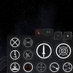
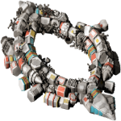
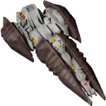

---

	additional.command.buttons.radial           the plugin name
	           html img with plugin icon url
	additional.command.buttons.radial.zip      release zip name of the plugin, special chars and spaces are replaced by dots
	https://github.com/zuckungtest/endless-sky-plugins/releases/download/v1.0.23-additional.command.buttons.radial/  url to the plugin release
	201.07 kb           plugin size in mb or kb, or 'N/A' if no release found
	2025-04-17   last modified date of the plugin release zip file, or 'N/A' if no release found
	https://github.com/zuckungtest/endless-sky-plugins/tree/main/myplugins/      url path to the plugin folder
	additional.command.buttons.radial  plugin folder name, with space replaced by %20
	| <a href="res/imagemd/additional.command.buttons.radial.md">view images</a> [47]        html link to a seperate plugin md file with all images of that plugin
	>Reworks the main buttons ui on the lower right side. Made for the ANDROID version of ES. See the README for details.    content of the plugin's' plugin.txt or about.txt, or 'N/A' if none found
	### additional.command.buttons  

 

Reworks the main buttons ui on the lower right side. Made for the ANDROID version of ES.  

 

 

This plugin 

- rearranges and resizes some of the buttons 

- changes most icons (making a ring around as a standard)

- adds more permanent buttons from the radial menus to make them easy accessible 

- removes the radial menus 

- adds a new button row to the top right for the fleet commands 

- adds zoom buttons 

- adds more targeting buttons 

- greyes out inactive buttons 

- puts images behind the buttons, to grey out unavailable. 

- changes the ship hud 

 

 

 

Changelog: 

 

2025-03-14 

added reverse thrust/afterburner button to bottom left 

 

2025-02-28 

moved the fleet box below the text box 

adjusted onscreen joystick size 

 

2025-02-23 

added new fleet jump button 

moved targeting buttons to the lower right 

removed fleet attack from normal attack button 

removed targeting button from target display 

 

2025-02-06 

the targeting buttons blocked the new scanner attribute display, so i moved it up 

hollowed and colorized the targeting buttons 

 

2025-02-04 

increased the size of the fuel, energy and heat bar to handle fuel up to 4400 

resized message box to not overlap with 2 rows of escorts 

restored the somehow missing tactical information display 

added "target nearest enemy" and "target nearest asteroid" buttons 

removed the color folders, white is enough 

 

2024-12-28 

moved the ammo box to the left side if the lower buttons 

added ship hud (inspired by Upmost Bsc | https://github.com/tobersj/Central-HUD) 

 

2024-11-20 

added small main menu button to the top left corner (requested by tarminu) 

 

2024-11-02 

removed hold fire button, because it's unsure when/if it comes back 

changed fast forward button back to small again, because it messed up the mission overview 

added 5 colour schemes(red, green, blue, purple, orange)

 

2024-10-29 

deactivated hold fire button, because it got removed in 0.10.10 

 

2024-10-11 

added fleet formations button 

 

2024-10-07 

added fleet hold fire button 

 

2024-09-06 

fine tuning for the graphics 

 

2024-09-02 

fixed button radius typo on fleet gather 

moved the fleet commands to the right side, so the jump systems are better seen 

 

2024-08-31 

changed button background to look more natural 

 

2024-08-30 

fixed an error 

adjusted positions 

added zoom buttons 

all buttons are visible now, but greyed out if you can't use them 

reworked all buttons to display a ring around them 

resized the fast forward button in the upper left corner, and added a greyed out version 

 

2024-08-25 

added a new panel for the fleet commands to the top center 

reworked the toggle ammo button 

removed the expandable radial menus, because all buttons are on the screen now 

exchanged some of the button positions 

 

2024-05-09 

initial release 
         content of the plugin's' README.md or 'N/A' if none found
	 
screenshots(click to enlarge): 
<table>
	<tr>
		<td></td>
	</tr>
</table>
 
    html table of the plugin screenshots from the screenshot folder, or '' if none found
	1.0.23        version number

### additional.command.buttons.radial

[additional.command.buttons.radial.zip](https://github.com/zuckungtest/endless-sky-plugins/releases/download/v1.0.23-additional.command.buttons.radial/additional.command.buttons.radial.zip) | 201.07 kb | 2025-04-17 | [view files](https://github.com/zuckungtest/endless-sky-plugins/tree/main/myplugins/additional.command.buttons.radial/) | <a href="res/imagemd/additional.command.buttons.radial.md">view images</a> [47] 
 
>Reworks the main buttons ui on the lower right side. Made for the ANDROID version of ES. See the README for details.

:blue_book: Plugin readme

<blockquote>### additional.command.buttons  

 

Reworks the main buttons ui on the lower right side. Made for the ANDROID version of ES.  

 

 

This plugin 

- rearranges and resizes some of the buttons 

- changes most icons (making a ring around as a standard)

- adds more permanent buttons from the radial menus to make them easy accessible 

- removes the radial menus 

- adds a new button row to the top right for the fleet commands 

- adds zoom buttons 

- adds more targeting buttons 

- greyes out inactive buttons 

- puts images behind the buttons, to grey out unavailable. 

- changes the ship hud 

 

 

 

Changelog: 

 

2025-03-14 

added reverse thrust/afterburner button to bottom left 

 

2025-02-28 

moved the fleet box below the text box 

adjusted onscreen joystick size 

 

2025-02-23 

added new fleet jump button 

moved targeting buttons to the lower right 

removed fleet attack from normal attack button 

removed targeting button from target display 

 

2025-02-06 

the targeting buttons blocked the new scanner attribute display, so i moved it up 

hollowed and colorized the targeting buttons 

 

2025-02-04 

increased the size of the fuel, energy and heat bar to handle fuel up to 4400 

resized message box to not overlap with 2 rows of escorts 

restored the somehow missing tactical information display 

added "target nearest enemy" and "target nearest asteroid" buttons 

removed the color folders, white is enough 

 

2024-12-28 

moved the ammo box to the left side if the lower buttons 

added ship hud (inspired by Upmost Bsc | https://github.com/tobersj/Central-HUD) 

 

2024-11-20 

added small main menu button to the top left corner (requested by tarminu) 

 

2024-11-02 

removed hold fire button, because it's unsure when/if it comes back 

changed fast forward button back to small again, because it messed up the mission overview 

added 5 colour schemes(red, green, blue, purple, orange)

 

2024-10-29 

deactivated hold fire button, because it got removed in 0.10.10 

 

2024-10-11 

added fleet formations button 

 

2024-10-07 

added fleet hold fire button 

 

2024-09-06 

fine tuning for the graphics 

 

2024-09-02 

fixed button radius typo on fleet gather 

moved the fleet commands to the right side, so the jump systems are better seen 

 

2024-08-31 

changed button background to look more natural 

 

2024-08-30 

fixed an error 

adjusted positions 

added zoom buttons 

all buttons are visible now, but greyed out if you can't use them 

reworked all buttons to display a ring around them 

resized the fast forward button in the upper left corner, and added a greyed out version 

 

2024-08-25 

added a new panel for the fleet commands to the top center 

reworked the toggle ammo button 

removed the expandable radial menus, because all buttons are on the screen now 

exchanged some of the button positions 

 

2024-05-09 

initial release 
</blockquote>

 
screenshots(click to enlarge): 
<table>
	<tr>
		<td></td>
	</tr>
</table>
 

 

---

	automata.destruction.0percent           the plugin name
	           html img with plugin icon url
	automata.destruction.0percent.zip      release zip name of the plugin, special chars and spaces are replaced by dots
	https://github.com/zuckungtest/endless-sky-plugins/releases/download/v1.0.2-automata.destruction.0percent/  url to the plugin release
	44.09 kb           plugin size in mb or kb, or 'N/A' if no release found
	2025-04-17   last modified date of the plugin release zip file, or 'N/A' if no release found
	https://github.com/zuckungtest/endless-sky-plugins/tree/main/myplugins/      url path to the plugin folder
	automata.destruction.0percent  plugin folder name, with space replaced by %20
	| <a href="res/imagemd/automata.destruction.0percent.md">view images</a> [1]        html link to a seperate plugin md file with all images of that plugin
	>Modifies the self destruction chance of Sestor and Mereti ships to a value of 0.0 (0%). See the README for details.    content of the plugin's' plugin.txt or about.txt, or 'N/A' if none found
	### automata.destruction.0percent

 

 

Modifies the self destruction chance of Sestor and Mereti ships to a value of 0.0 (0%). 

 

Sestor 349/109/78/71/53/27/14 and Mereti 512/256/128/64/32/16/8 ships have a self destruction value of 0.0 (0%) now. 

You can easily change the values in automata.txt for each ship ('"self destruct" .0') to a value of your choice. I.e. 0.12 is 23%, 0.3 is 51%, 0.5 is 75%. Its calculated twice, first the chance for self destruction on boarding(i.e. 0.3) is 30%, then of the remaining 70% again 30% chance for self destruction on capturing. That makes 30% + 21% = 51% overall chance for self destruction on a capturing try. 

 

 

Changelog: 

 

2024-06-07 

text corrections (thx to TheGiraffe3) 

 

2023-10-17 

added plugin.txt 

 

2023-09-07 

changed icon 

changed about.txt 

changed readme 

         content of the plugin's' README.md or 'N/A' if none found
	    html table of the plugin screenshots from the screenshot folder, or '' if none found
	1.0.2        version number

### automata.destruction.0percent

[automata.destruction.0percent.zip](https://github.com/zuckungtest/endless-sky-plugins/releases/download/v1.0.2-automata.destruction.0percent/automata.destruction.0percent.zip) | 44.09 kb | 2025-04-17 | [view files](https://github.com/zuckungtest/endless-sky-plugins/tree/main/myplugins/automata.destruction.0percent/) | <a href="res/imagemd/automata.destruction.0percent.md">view images</a> [1] 
 
>Modifies the self destruction chance of Sestor and Mereti ships to a value of 0.0 (0%). See the README for details.

:blue_book: Plugin readme

<blockquote>### automata.destruction.0percent

 

 

Modifies the self destruction chance of Sestor and Mereti ships to a value of 0.0 (0%). 

 

Sestor 349/109/78/71/53/27/14 and Mereti 512/256/128/64/32/16/8 ships have a self destruction value of 0.0 (0%) now. 

You can easily change the values in automata.txt for each ship ('"self destruct" .0') to a value of your choice. I.e. 0.12 is 23%, 0.3 is 51%, 0.5 is 75%. Its calculated twice, first the chance for self destruction on boarding(i.e. 0.3) is 30%, then of the remaining 70% again 30% chance for self destruction on capturing. That makes 30% + 21% = 51% overall chance for self destruction on a capturing try. 

 

 

Changelog: 

 

2024-06-07 

text corrections (thx to TheGiraffe3) 

 

2023-10-17 

added plugin.txt 

 

2023-09-07 

changed icon 

changed about.txt 

changed readme 

</blockquote>

 

---

	automata.in.human.space           the plugin name
	           html img with plugin icon url
	automata.in.human.space.zip      release zip name of the plugin, special chars and spaces are replaced by dots
	https://github.com/zuckungtest/endless-sky-plugins/releases/download/v1.0.2-automata.in.human.space/  url to the plugin release
	35.87 kb           plugin size in mb or kb, or 'N/A' if no release found
	2025-04-17   last modified date of the plugin release zip file, or 'N/A' if no release found
	https://github.com/zuckungtest/endless-sky-plugins/tree/main/myplugins/      url path to the plugin folder
	automata.in.human.space  plugin folder name, with space replaced by %20
	| <a href="res/imagemd/automata.in.human.space.md">view images</a> [1]        html link to a seperate plugin md file with all images of that plugin
	>Brings jump drive equipped automata into human space after the wanderer campaign. See the README for details.    content of the plugin's' plugin.txt or about.txt, or 'N/A' if none found
	### automata.in.human.space

 

 

Brings jump drive equipped automata into human space after the wanderer campaign.  

 

You can find them where Korath ships in human space are usually found(ember waste and eastern syndicate).  

The chance to encounter previous Korath ships or automata is like 50/50.  

 

 

Changelog: 

 

2024-09-24 

removed jumpdrive from fighters and drones and put them correctly into the carriers 

adjusted some fleet variants 

 

2023-10-17 

added plugin.txt 

 

2023-09-01 

added more fleet variants  

reworked readme  

changed icon.png 

         content of the plugin's' README.md or 'N/A' if none found
	    html table of the plugin screenshots from the screenshot folder, or '' if none found
	1.0.2        version number

### automata.in.human.space

[automata.in.human.space.zip](https://github.com/zuckungtest/endless-sky-plugins/releases/download/v1.0.2-automata.in.human.space/automata.in.human.space.zip) | 35.87 kb | 2025-04-17 | [view files](https://github.com/zuckungtest/endless-sky-plugins/tree/main/myplugins/automata.in.human.space/) | <a href="res/imagemd/automata.in.human.space.md">view images</a> [1] 
 
>Brings jump drive equipped automata into human space after the wanderer campaign. See the README for details.

:blue_book: Plugin readme

<blockquote>### automata.in.human.space

 

 

Brings jump drive equipped automata into human space after the wanderer campaign.  

 

You can find them where Korath ships in human space are usually found(ember waste and eastern syndicate).  

The chance to encounter previous Korath ships or automata is like 50/50.  

 

 

Changelog: 

 

2024-09-24 

removed jumpdrive from fighters and drones and put them correctly into the carriers 

adjusted some fleet variants 

 

2023-10-17 

added plugin.txt 

 

2023-09-01 

added more fleet variants  

reworked readme  

changed icon.png 

</blockquote>

 

---

	better.starts           the plugin name
	           html img with plugin icon url
	better.starts.zip      release zip name of the plugin, special chars and spaces are replaced by dots
	https://github.com/zuckungtest/endless-sky-plugins/releases/download/v1.0.6-better.starts/  url to the plugin release
	23.58 kb           plugin size in mb or kb, or 'N/A' if no release found
	2025-04-17   last modified date of the plugin release zip file, or 'N/A' if no release found
	https://github.com/zuckungtest/endless-sky-plugins/tree/main/myplugins/      url path to the plugin folder
	better.starts  plugin folder name, with space replaced by %20
	| <a href="res/imagemd/better.starts.md">view images</a> [1]        html link to a seperate plugin md file with all images of that plugin
	>Adds several new start options with different ships, background stories, credits and debts. See the README for details.    content of the plugin's' plugin.txt or about.txt, or 'N/A' if none found
	### better.starts  

 

Adds several new start options with different ships, background stories, credits and debts. 

 

<ul>

<li>Start: Trader | Freighter: equipped for cargo transport, in Merak system</li>

<li>Start: Trader (Hai) | Aphid: equipped for cargo transport, in Fah Soom system(Hai space)</li>

<li>Start: Passenger Transport | Scout: equipped for passenger transport, Talita system</li>

<li>Start: Miner | Sunder: equipped for mining, in Rasalhague system</li>

<li>Start: Salvager | Shuttle: equipped for boarding, in Aldhibain system</li>

<li>Start: Salvager(big) | Argosy: equipped for boarding, in Aldhibain system</li>

<li>Start: Explorer to Remnant | Heavy Shuttle: equipped for exploring the Remnant, in Tania Australis system</li>

<li>Start: Explorer to Automata | Bounder: equipped for exploring the Kor Automata, in Mirfak system</li>

<li>Start: Cheater 1 | Heron + 10xKIV: 1b credits, full visible human space, Jump Drive, in Sol system, no story</li>

<li>Start: Cheater 2 | Heron + 10xSkylark: 1b credits, full visible human space, Jump Drive, in Sol system, no story</li>

</ul>

 

Beside the cheater start options, all others are balanced and lore friendly. A bigger ship means a bigger bank loan. All starts come with 200.000 credits cash and a bank loan between 600.000 and 4,5 million credits. The ships outfits are changed to fit the role. The intro missions on New Boston are set as completed. Same goes for the Hai start with the Hai first contact mission. 

 

 

Changelog: 

 

2024-11-02  

changed cheater 2 start heron to have 20 heavy warship bays 

 

2024-10-08  

proofreading and minor text changes (Vemenous-Repentile) 

added a new cheater start with Quarg outfits, ships and more credits 

 

2024-06-07 

text corrections (thx to TheGiraffe3) 

 

2024-03-15 

Start: Cheater, changed Heron weapons and added 10x KIV with beam weapons 

Start: Cheater, added mission for full visible human space to the outfitter 

 

2024-02-15 

Start: Cheater... fixed map not showing all systems 

Start: Miner... changed ship to "Sunder" with 2 Mining Drones 

 

2023-10-17 

added plugin.txt 

 

2023-09-15 

added passenger transport start 

set intro missions to done for all starts 

doubled bank loan duration / halfed interest rate for all starts 

changed cheater start ship and credits 

 

2023-09-03 

changed miner start to a system with outfitter 

added Start Trader Freighter 

added Start Trader (Hai) Aphid 

added Start Explorer to Remnant 

added Start Explorer to Automata 

         content of the plugin's' README.md or 'N/A' if none found
	 
screenshots(click to enlarge): 
<table>
	<tr>
		<td></td>
	</tr>
</table>
 
    html table of the plugin screenshots from the screenshot folder, or '' if none found
	1.0.6        version number

### better.starts

[better.starts.zip](https://github.com/zuckungtest/endless-sky-plugins/releases/download/v1.0.6-better.starts/better.starts.zip) | 23.58 kb | 2025-04-17 | [view files](https://github.com/zuckungtest/endless-sky-plugins/tree/main/myplugins/better.starts/) | <a href="res/imagemd/better.starts.md">view images</a> [1] 
 
>Adds several new start options with different ships, background stories, credits and debts. See the README for details.

:blue_book: Plugin readme

<blockquote>### better.starts  

 

Adds several new start options with different ships, background stories, credits and debts. 

 

<ul>

<li>Start: Trader | Freighter: equipped for cargo transport, in Merak system</li>

<li>Start: Trader (Hai) | Aphid: equipped for cargo transport, in Fah Soom system(Hai space)</li>

<li>Start: Passenger Transport | Scout: equipped for passenger transport, Talita system</li>

<li>Start: Miner | Sunder: equipped for mining, in Rasalhague system</li>

<li>Start: Salvager | Shuttle: equipped for boarding, in Aldhibain system</li>

<li>Start: Salvager(big) | Argosy: equipped for boarding, in Aldhibain system</li>

<li>Start: Explorer to Remnant | Heavy Shuttle: equipped for exploring the Remnant, in Tania Australis system</li>

<li>Start: Explorer to Automata | Bounder: equipped for exploring the Kor Automata, in Mirfak system</li>

<li>Start: Cheater 1 | Heron + 10xKIV: 1b credits, full visible human space, Jump Drive, in Sol system, no story</li>

<li>Start: Cheater 2 | Heron + 10xSkylark: 1b credits, full visible human space, Jump Drive, in Sol system, no story</li>

</ul>

 

Beside the cheater start options, all others are balanced and lore friendly. A bigger ship means a bigger bank loan. All starts come with 200.000 credits cash and a bank loan between 600.000 and 4,5 million credits. The ships outfits are changed to fit the role. The intro missions on New Boston are set as completed. Same goes for the Hai start with the Hai first contact mission. 

 

 

Changelog: 

 

2024-11-02  

changed cheater 2 start heron to have 20 heavy warship bays 

 

2024-10-08  

proofreading and minor text changes (Vemenous-Repentile) 

added a new cheater start with Quarg outfits, ships and more credits 

 

2024-06-07 

text corrections (thx to TheGiraffe3) 

 

2024-03-15 

Start: Cheater, changed Heron weapons and added 10x KIV with beam weapons 

Start: Cheater, added mission for full visible human space to the outfitter 

 

2024-02-15 

Start: Cheater... fixed map not showing all systems 

Start: Miner... changed ship to "Sunder" with 2 Mining Drones 

 

2023-10-17 

added plugin.txt 

 

2023-09-15 

added passenger transport start 

set intro missions to done for all starts 

doubled bank loan duration / halfed interest rate for all starts 

changed cheater start ship and credits 

 

2023-09-03 

changed miner start to a system with outfitter 

added Start Trader Freighter 

added Start Trader (Hai) Aphid 

added Start Explorer to Remnant 

added Start Explorer to Automata 

</blockquote>

 
screenshots(click to enlarge): 
<table>
	<tr>
		<td></td>
	</tr>
</table>
 

 
